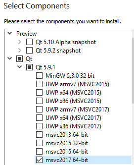
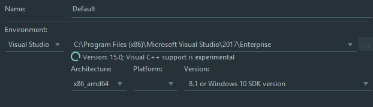

#Windows

1. Install Visual Studio (2017) (get key at console.bocal.org then msdna)
2. Install QT https://www1.qt.io/download-open-source/
3. During install, select msvc instead of mingw as in the below img:




4. In Clion go to settings -> Build Execution Deployment -> Cmake
5. Click on the dot near Environnemnt and add:
> CMAKE_PREFIX_PATH C:\Qt\5.9.1\msvc2017_64
6. Now click on toolchain (above Cmake) and be sure the environement is Visual Studio:



7. And Architecture x86_amd64
8. Now everything should work fine !

##WARNING !

> If when you run the executable from file manager it says: Missilg XXX.dll, make sure than there is a lot of .dll files at this adress: C:/Qt/5.9.1/msvc2017_64/bin/
> Otherwise change the line in the main Cmake which copy these files with your path (you can ctrl+f ##ANCHOR 78554)

#Utils

Cmd in windows to generate a Visual Studio Solution:
```
Debug:
cmake -DCMAKE_BUILD_TYPE=Debug -G "Visual Studio 15 2017 Win64" [PATH TO CMAKELIST]
Release:
cmake -DCMAKE_BUILD_TYPE=Release -G "Visual Studio 15 2017 Win64" [PATH TO CMAKELIST]
```

And to build (from the cmdline after the above cmd)
```
Debug:
cmake --build . --config Debug
Release:
cmake --build . --config Release
```

So, create a "build" folder and then call these command from that folder in order to not corrupt the source folder.